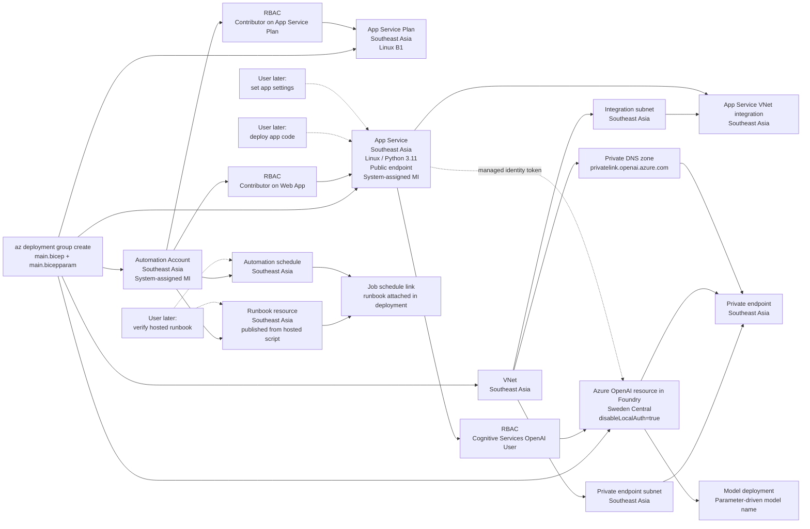

## Project scope

This repository is **Bicep-only**. It provisions infrastructure, managed identities, and RBAC at **resource-group scope** by using a single `main.bicep` entrypoint plus exactly one `main.bicepparam` file.

Deployment is executed with Azure CLI, for example:

`az deployment group create --resource-group <rg> --template-file main.bicep --parameters main.bicepparam`

This repository is **infra-first**. It provisions the platform, publishes the Automation runbook from a hosted script URL, links that runbook to an Automation schedule, and leaves the web application code deployment plus final application settings to later steps.

## Deployment contract

The initial deployment creates the following resources.

- **App Service Plan**: one Linux App Service Plan in **Southeast Asia** with SKU `B1`.
- **App Service**: one Linux Web App in **Southeast Asia**, **internet-facing**, with **system-assigned managed identity** enabled.
- **Virtual Network**: one VNet in **Southeast Asia** with dedicated subnets for App Service VNet integration and the private endpoint.
- **Azure OpenAI resource in Foundry**: one new AI resource in **Sweden Central** with `disableLocalAuth: true`.
- **Model deployment**: one Azure OpenAI model deployment under the AI resource, with the model name supplied from parameters.
- **Private Endpoint**: one private endpoint in **Southeast Asia** that connects the VNet to the Foundry / Azure OpenAI resource.
- **Private DNS**: one private DNS zone for Azure OpenAI private-link name resolution, linked to the VNet.
- **Automation Account**: one Automation Account in **Southeast Asia** with **system-assigned managed identity** enabled.
- **Runbook**: one **PowerShell 7.2** runbook resource in **Southeast Asia** with the exact requested name; its content is published from a hosted script URL during deployment.
- **Schedule**: one Automation schedule in **Southeast Asia**.
- **Runbook schedule link**: one Automation job-schedule resource that attaches the runbook to the schedule and passes the deployment subscription, resource group, and App Service Plan name as runbook parameters.
- **RBAC assignment 1**: assign the App Service managed identity the **`Cognitive Services OpenAI User`** role on the AI resource.
- **RBAC assignment 2**: assign the Automation Account managed identity the **`Contributor`** role on the **App Service Plan** scope.
- **RBAC assignment 3**: assign the Automation Account managed identity the **`Contributor`** role on the **Web App** scope so the runbook can update `AlwaysOn`.

## App Service configuration

The Web App is created as a public App Service endpoint. This means it is reachable through its default `*.azurewebsites.net` hostname and is **not** deployed behind a private endpoint in this repository.

The Web App and its App Service Plan are deployed in **Southeast Asia**.

The Web App is also integrated with the **Southeast Asia** VNet by using a dedicated integration subnet. This VNet integration is for **outbound** connectivity from the app to private resources, including the private endpoint of the Azure OpenAI resource.

The Web App is configured with:

- Python runtime: `PYTHON|3.11`
- Startup command: `python3 -m gunicorn main:app --bind 0.0.0.0:$PORT`
- App settings:
  - `AZURE_OPENAI_BASE_URL`
  - `PROXY_API_KEY`
  - `APP_INSIGHTS_CONNECTION_STRING`
  - `SCM_DO_BUILD_DURING_DEPLOYMENT=1`

`PROXY_API_KEY` is created with an empty value and is expected to be set by the user later.

`APP_INSIGHTS_CONNECTION_STRING` is also parameter-driven and should be set to the final Application Insights connection string value for the deployed app.

`SCM_DO_BUILD_DURING_DEPLOYMENT=1` is preconfigured now, but it only becomes meaningful when the user later deploys the Python application package.

`AZURE_OPENAI_BASE_URL` is set automatically from `aiAccountName` by the template. Users should change the AI resource name, not maintain a separate base-URL parameter.

## Azure OpenAI / Foundry behavior

The AI resource is deployed as a **new** resource in **Sweden Central**. Local key-based authentication is disabled by policy through `disableLocalAuth: true`.

The Azure OpenAI resource should also have **public network access disabled** after the private endpoint is in place.

The stack also creates a model deployment under that Azure OpenAI resource. The deployment name and model name are both parameterized so you can change the model without editing the template. A typical value for `modelName` is **`gpt-5.4`**.
The model version is also parameterized. If you are deploying GPT-5.4 and your portal shows version **`2026-03-05`**, set `modelVersion = '2026-03-05'`.
The deployment SKU, capacity, and model-upgrade policy are also parameterized. The current defaults are:

- `modelDeploymentSkuName = 'GlobalStandard'`
- `modelDeploymentCapacity = 200`
- `modelVersionUpgradeOption = 'OnceNewDefaultVersionAvailable'`

The deployment does not hard-code a custom `raiPolicyName`. It relies on the platform default content filtering / guardrail policy rather than assuming an undocumented built-in ARM policy name for "filter v2".

The Web App app setting `AZURE_OPENAI_BASE_URL` is derived automatically as `https://<aiAccountName>.openai.azure.com`.

The private endpoint is deployed into the **Southeast Asia** VNet and connected to the Azure OpenAI resource in **Sweden Central**. DNS resolution for the OpenAI endpoint should be handled through a private DNS zone linked to that VNet.

The Web App authenticates to this AI resource by using its **system-assigned managed identity** and the `Cognitive Services OpenAI User` role assignment. This removes the need for the application to store or use an Azure OpenAI key.

## Automation behavior

The Automation Account and runbook are deployed in **Southeast Asia**. The Automation Account is deployed with a **system-assigned managed identity**.

That identity is granted **Contributor** on the **App Service Plan** resource scope and also on the **Web App** resource scope. The template still does **not** grant Contributor on the full resource group.

The runbook resource is created in the initial deployment as a **PowerShell 7.2** runbook and its script content is published from the configured hosted URL.

The initial deployment also creates an Automation schedule resource and binds it to the runbook automatically.

The scheduled job passes these runbook parameters automatically:

- `SubscriptionId = <current deployment subscription>`
- `ResourceGroupName = <current deployment resource group>`
- `AppServicePlanName = <appServicePlanName parameter value>`

The expected post-deployment flow is:

- deploy the infrastructure with Bicep
- verify the hosted runbook content published correctly

## Naming rule

All deployable resource names use the **exact values** provided in the parameter file. The template does **not** add prefixes, suffixes, hashes, or random strings.

The only exception is **role assignment resource names**, because Azure RBAC role assignments must use GUID-form names. Those should be generated deterministically from scope, principal ID, and role definition ID.

## Out of scope

The following actions are intentionally outside the initial Bicep deployment:

- deploying the web app code
- setting the final `PROXY_API_KEY`
- setting the final `APP_INSIGHTS_CONNECTION_STRING`
- applying tags

This means a successful infrastructure deployment does **not** imply that the application is fully functional yet. The Web App shell, identity, and permissions will exist, but the application code and final secret value are added later.

## Suggested file layout

- `main.bicep`
- `main.bicepparam`
- `modules/vnet.bicep`
- `modules/appservice-plan.bicep`
- `modules/webapp.bicep`
- `modules/ai-account.bicep`
- `modules/ai-deployment.bicep`
- `modules/private-endpoint.bicep`
- `modules/private-dns-zone.bicep`
- `modules/webapp-vnet-integration.bicep`
- `modules/automation-account.bicep`
- `modules/runbook.bicep`
- `modules/job-schedule.bicep`
- `modules/schedule.bicep`
- `modules/role-assignment.bicep`
- `scripts/deploy-webapp.ps1`
- `scripts/deploy-webapp.sh`

A single generic `role-assignment.bicep` module can be reused for both RBAC assignments.

## Recommended parameters

The single `main.bicepparam` file should hold the exact deploy-time values, such as:

- `location = 'southeastasia'`
- `aiLocation = 'swedencentral'`
- `vnetName`
- `vnetAddressPrefix`
- `integrationSubnetName`
- `integrationSubnetPrefix`
- `privateEndpointSubnetName`
- `privateEndpointSubnetPrefix`
- `privateDnsZoneName = 'privatelink.openai.azure.com'`
- `privateEndpointName`
- `appServicePlanName`
- `webAppName`
- `aiAccountName`
- `modelDeploymentName`
- `modelName = 'gpt-5.4'`
- `modelVersion = '2026-03-05'`
- `modelDeploymentSkuName = 'GlobalStandard'`
- `modelDeploymentCapacity = 200`
- `modelVersionUpgradeOption = 'OnceNewDefaultVersionAvailable'`
- `automationAccountName`
- `runbookName`
- `runbookContentUri`
- `scheduleName`
- `scheduleFrequency = 'Hour'`
- `scheduleInterval = 1`
- `scheduleTimeZone = 'SE Asia Standard Time'`
- `scheduleStartTime`
- `pythonLinuxFxVersion = 'PYTHON|3.11'`
- `startupCommand = 'python3 -m gunicorn main:app --bind 0.0.0.0:$PORT'`
- `proxyApiKey = ''`
- `appInsightConnectionString = ''`

There is **no tags parameter**.

If `scheduleStartTime` is omitted from the parameter file, the template defaults it to **1 hour after deployment time (UTC)**.

## Recommended outputs

Useful outputs from `main.bicep` are:

- Web App name
- Web App default hostname
- Web App managed identity `principalId`
- VNet resource ID
- App Service integration subnet resource ID
- Private endpoint resource ID
- App Service Plan resource ID
- AI resource name
- AI endpoint / base URL
- Model deployment name
- Automation Account name
- Automation Account managed identity `principalId`
- Runbook name
- Schedule name
- Job schedule resource ID

## Dependency order

The deployment should resolve in this order:

1. VNet and subnets  
2. App Service Plan  
3. App Service  
4. AI resource  
5. Model deployment  
6. Private DNS zone and VNet link  
7. Private endpoint to the AI resource  
8. App Service VNet integration  
9. RBAC: App Service managed identity -> AI resource  
10. Automation Account  
11. RBAC: Automation Account managed identity -> App Service Plan  
12. RBAC: Automation Account managed identity -> Web App  
13. Runbook resource  
14. Schedule resource  
15. Runbook-to-schedule job link  

After infrastructure deployment, the user performs these later actions:

- deploys the web application code
- sets `PROXY_API_KEY`
- sets `APP_INSIGHTS_CONNECTION_STRING`
- verifies the hosted runbook content if needed

The repository includes equivalent end-to-end deployment scripts:

- PowerShell: `./scripts/deploy-webapp.ps1 -ResourceGroupName <rg>`
- Bash: `./scripts/deploy-webapp.sh --resource-group <rg>`

Both scripts:

- create the resource group in `southeastasia`
- run `az deployment group create` with `main.bicep` and `main.bicepparam`
- default to the bundled `openai-responses-api.zip`
- derive `webAppName` from `main.bicepparam` if not passed explicitly
- support an override package source by local path or hosted ZIP URL

## Mermaid view

